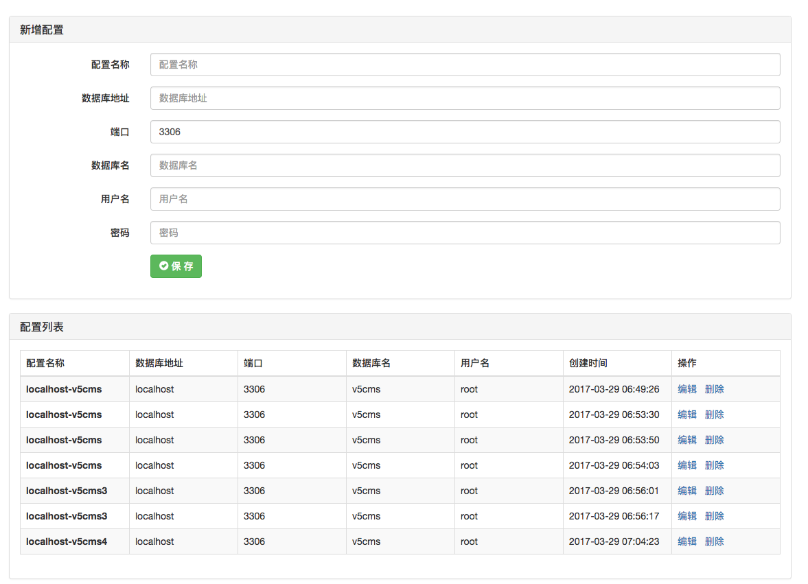
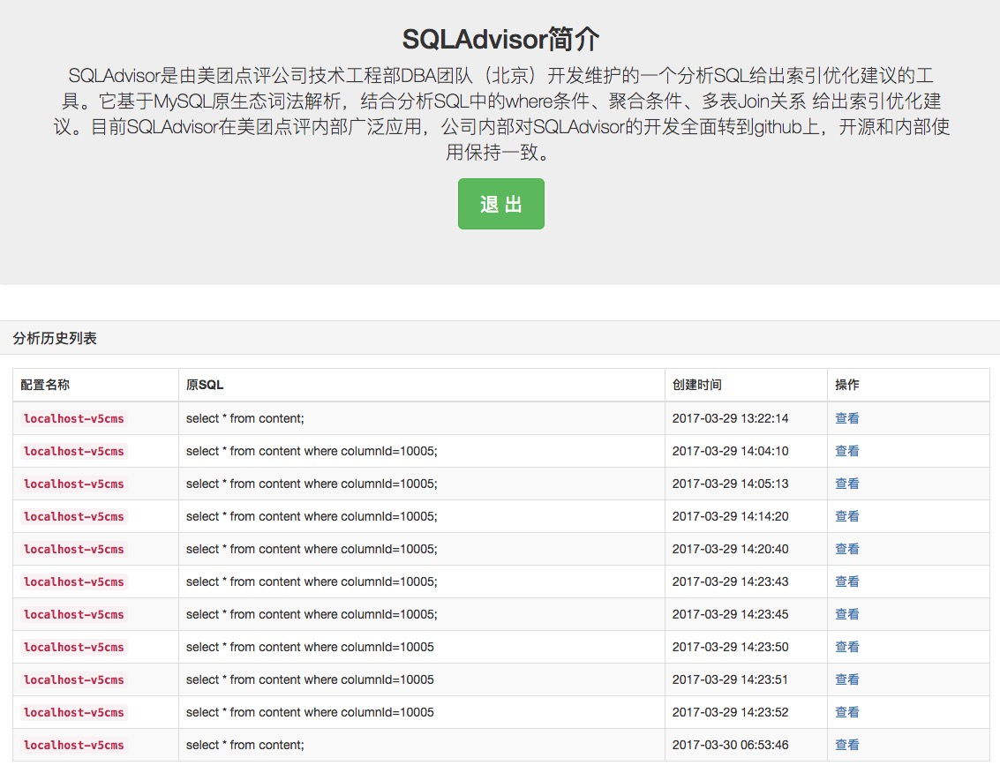

# sqladvisor-web
美团SQLAdvisor SQL优化建议工具的Web版，告别命令行。
* 项目中使用的美团SQL分析工具是在CentOS上编译的，所以建议部署到CentOS上。
* 该项目是使用Python的Flask框架开发的。
* 使用CentOS自带的Python版本,版本号是2.7.5。

## 安装依赖
```
pip install -r requirements.txt
```

## 恢复数据库
```
python manage.py db upgrade
```

## 启动系统
进入sqladvisor-web
```
python manage.py runserver --host 0.0.0.0
```

## 截图



